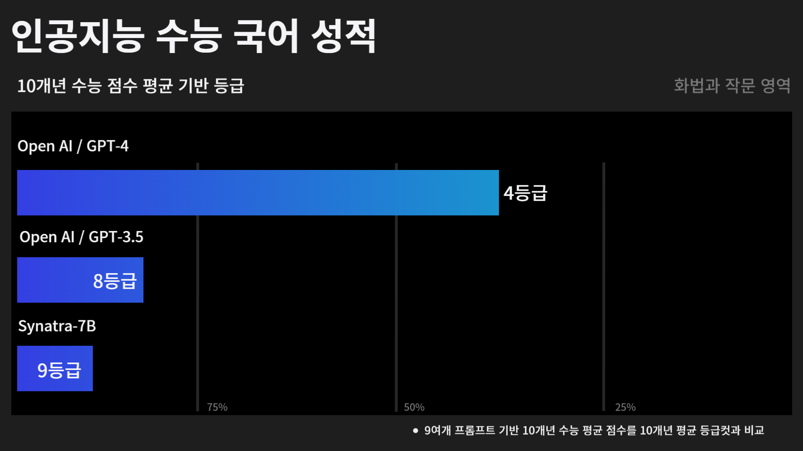
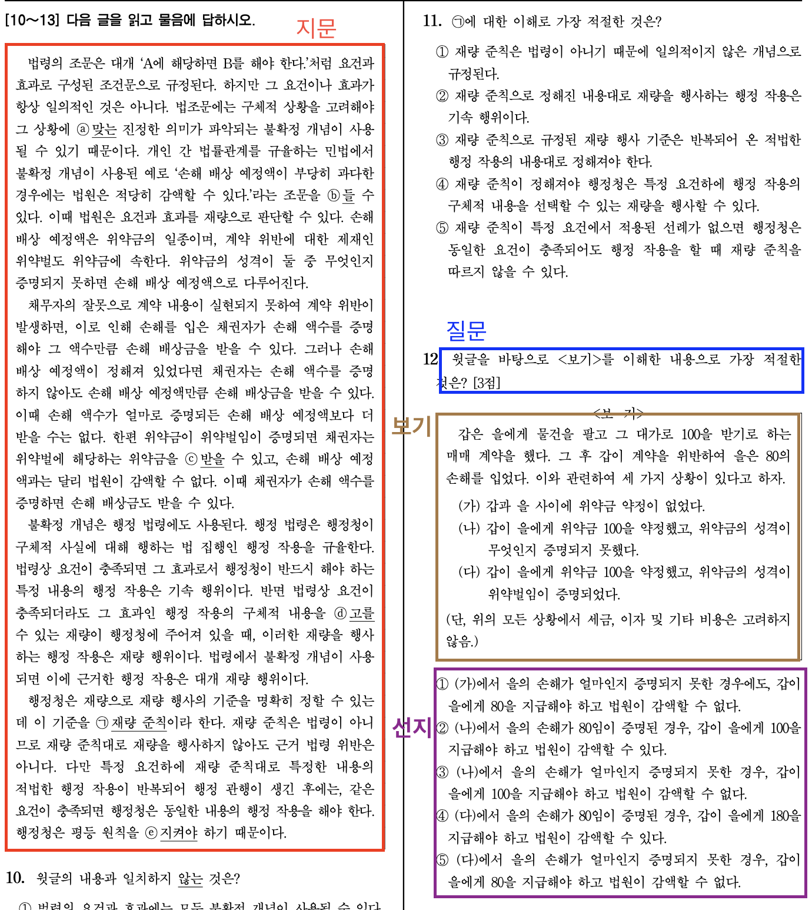
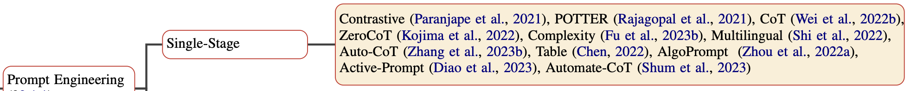

# AI 수능 국어 만점 프로젝트

## I. 요약 

### 2024.09 업데이트

최신 모델인 gpt-4o1, gpt-4o, gpt-4o-mini, 그리고 Upstage의 Solar Pro 모델을 포함하여 벤치마킹을 진행하였습니다.




1. 2015 ~ 2024년도 수능까지 **‘10개년도’** 수능 <U>데이터화 완료</U>.

2. 10개년도 전체 수능 응시를 위해서는 <U>8K 토큰 입력이 가능한 모델이 필요</U>하여,
   이에 만족하는 3개 모델 (GPT-4, Synatra-7b, GPT-3.5-16K)로 벤치마크 진행.

3. 총 9개 프롬프트로 벤치마크 진행 완료.

4. 벤치마크 결과:
   - GPT-4: `zero-shot-CoT 영어 프롬프트`의 성능이 가장 높았음.
   - GPT-3.5-16K: `형식 지정 프롬프트`의 성능이 가장 높았음.
   - Synatra-7b: `zero-shot-cot 영어 프롬프트`의 성능이 가장 높았음.

5. 9개 프롬프트의 점수 평균 

    🥇 GPT-4: 68점
    
    🥈 GPT-3.5-16K: 31점
    
    🥉 Synatra-7b: 15점
    
    → 큰 성능 차이가 존재.
    
6. 9개 프롬프트 중 상위 3개
    
    🥇 형식 지정 프롬프트
    
    🥈 zero-shot-CoT 영어 프롬프트
    
    🥉 zero-shot-CoT 프롬프트

## II. 데이터화

올해 2024학년도 수능을 포함하여 10개년 수능을 json 파일로 데이터화 하였습니다. 

데이터화는 다음과 같은 과정을 거쳐 진행되었습니다.

1. PDFminer 라이브러리를 사용하여 수능 문제 PDF에서 텍스트만을 추출. 
2. 추출한 텍스트를 질문, 지문, 보기, 선지로 구분.
    - 질문, 지문, 보기, 선지 예시
      
  
        
3. 페이지 수, 경고문 등 필요 없는 글자 제거.
4. [A], [B]와 같이 특정 단어나 문장을 가리키는 경우, 해당 부분을 소괄호로 묶어 표시.
5. 표나 사진의 경우, 해당 자료를 설명하는 설명 글을 직접 적어서 대체.
6. 각 문제에 배점과 정답 번호를 기입.

## III. 프롬프트 선정

### [요약]
모델별 최적 프롬프트를 찾는 것이 아닌, 잘 알려진 프롬프트 기법들을 기준으로 성능을 측정 했습니다. 

### 사용 가능 프롬프트

주요한 프롬프트는 다음 서베이 [논문](https://aclanthology.org/2023.acl-long.294.pdf)을 참고하여 찾을 수 있었습니다.



해당 서베이 논문에서 제시한 프롬프트의 설명과 반영 여부 및 이유는 다음과 같습니다.

### ❌ Contrastive [[논문](https://aclanthology.org/2021.findings-acl.366.pdf)]

제외함

- 설명 : 문제를 풀이할 때, 문제의 내용과 대조되는 인간의 설명을 같이 제공한다. 
다른 관점에서 생각하게 해 성능을 높이는 프롬프트.
- 제외 이유 : 각 문제마다 다른 관점에서 생각하는 설명을 작성하기 힘들다.

### ⚠️ POTTER [[논문](https://arxiv.org/pdf/2111.00539.pdf)]

일부 이용 (형식 지정 프롬프트)

- 설명 : 질문에 대한 풀이에 템플릿을 제시.
LLM이 빈칸을 채우는 형식으로 풀이를 작성하고 답을 도출해 성능을 높이는 프롬프트.
- 이용 방법 : 형식 지정 프롬프트에서 풀이의 형식을 지정해주기 때문에, POTTER 방법과 완전히 동일하지는 않지만 다양한 풀이가 존재하는 수능 문제 유형에 알맞게 변형하였다고 할 수 있다.

### ⭕ CoT, ZeroCoT

이용 (zero-shot-CoT)

### ❌ Complexity [[논문](https://openreview.net/pdf?id=yf1icZHC-l9)]

제외함

- 설명 : 복잡한 문제의 경우, 5개 이상의 복잡한 단계를 거쳐 풀이해야 한다. 
단계의 수가 바뀌면, 정답이 달라질 수 있다. 
여러 단계의 각각 다른 풀이 방법들을 모두 돌린 후, voting ensemble로 최종 정답을 선정한다.
- 제외 이유 : 수행하기 위해 너무 많은 프롬프트가 소요되므로, API 비용 문제로 인해 제외했다.

### ❌ Auto-CoT [[논문](https://openreview.net/forum?id=5NTt8GFjUHkr)]

제외함

- 설명 : 문제와 유사한 풀이를 클러스터링을 통해 찾아서, 자동으로 유사한 문제의 풀이를 찾아서 프롬프트에 넣어주는 방법.
- 제외 이유 : 풀이 데이터는 데이터화 하지 않아 이용할 수 없음.

### ⭕ Multilingual [[논문](https://arxiv.org/pdf/2210.03057.pdf)]

이용

- 설명 : 기본적으로 한국어로 진행하는 시험이며, 영어로 instruction을 변경한 프롬프트 역시 실험함. (zero-shot-cot 영어 프롬프트)

### ❌ Table, AlgoPrompt

제외함

- 설명 : 각각 표와 알고리즘 문제와 관련한 프롬프팅 기법
- 제외 이유: 수능 문제와 적합하지 않음.

### ⚠️ Active Prompting

이용 (일부만 테스트)

- 문제에 따라 프롬프트 중 일부의 토큰 수가 8K개를 넘어, 2개년 수능만 벤치마크.

### ❌ Automate-CoT [[논문](https://arxiv.org/pdf/2302.12822.pdf)]

제외함

- 이유 : 재훈련 과정이 들어가므로 제외.

이외에도 survey에 논문에 언급 되었거나, 다른 논문의 Plan-and-Solve, ranking, AI 자극, 감정적 호소 프롬프트들을 벤치마크에 사용했습니다.

## IV. 프롬프트 설명

### 1. 최소 프롬프트

프롬프트 엔지니어링이 들어가지 않은 최소한의 프롬프트만을 사용한 프롬프트 입니다. 

간단한 역할 설정과 지문, 질문, 선지, 보기가 포함됩니다. 그리고 반드시 정답 ‘하나’만 고르라는 프롬프트가 추가되어 있습니다.

- Baseline으로 사용되는 프롬프트
    
    ```bash
    국어 시험 문제를 푸는 똑똑한 학생으로서 다음 문제의 답을 구하세요.
    지문을 읽고, 질문에 대한 답을 1부터 5까지의 선택지 중에 한 개만 골라서 대답해야 합니다.
    ```
    

### 2. zero-shot-CoT

가장 기본적인 CoT(Chain of Thought) 형태입니다. 

[Kojima et al.](https://arxiv.org/abs/2205.11916)의 연구 결과에 따르면, `Let’s think step by step`을 프롬프트 끝에 추가하여 주는 것만으로도, LLM이 스스로 단계별로 생각을 정리하고 답변을 생성합니다.

가장 사용하기 간단하고 효과가 좋다고 알려져 있어, 프롬프트 엔지니어링에서 가장 많이 언급되는 방법론입니다.

- 한국어로 `단계별로 생각하며 정답을 고르세요`라고 변형하여 사용하였습니다.

### 3. zero-shot-CoT 영어

2번의 zero-shot-CoT와 내용은 동일하나, 프롬프트의 언어가 미치는 영향을 분석하기 위하여 instruction 및 프롬프트를 영어로 작성한 프롬프트입니다. 

- Instruction
    
    ```
    As a smart student answer the given question.
    Read paragraph, and select only one answer between 5 choices.
    ```
    
- 마지막에 `Let’s think step by step` 프롬프트를 사용했습니다.

### 4. Plan-and-Solve

LLM 스스로 문제를 풀기 위한 계획을 세우게 하고, 해당 계획에 따라 문제를 풀도록 하는 프롬프트입니다. 

[Wang et al.](https://arxiv.org/abs/2305.04091)의 연구에서 zero-shot-CoT 대신 Plan-and-Solve 프롬프트를 사용하였을 때, 6개의 math reasoning 데이터셋들에 대해 더욱 높은 성능을 보여주었습니다. 
(math reasoning 데이터셋들은 모두 논리적으로 문제를 이해하고, 계산을 수행하여 답을 구해야 하는 데이터입니다.)

- 원문 Plan-and-Solve 프롬프트
    
    ```
    Let's first understand the problem and devise a plan to solve the problem.
    Then, let's carry out the plan and solve the problme step by step.
    ```
    
- 프롬프트에 사용한 한국어 번역본
    
    ```
    먼저 문제를 이해하고, 문제 해결을 위하여 계획을 세워보세요.
    그 다음, 문제를 해결하기 위해 그 계획에 따라 단계별로 실행하세요.
    ```
    

### 5. 형식 지정 프롬프트

23 수능에서 좋은 성능을 보여주었던 프롬프트로, 수능의 특성에 맞추어 NomaDamas에서 직접 제작한 프롬프트입니다.

정답을 위해 대답을 내놓는 과정의 형식을 지정해, 설계된 문제 풀이 방식을 따르는 프롬프트입니다. 구체적으로, 지문에서 질문에 답하기 위한 증거를 무조건 찾게 한 이후, 답을 찾아가도록 하였습니다. 

‘지문에서 답을 찾아야 한다’라는 풀이 방법을 알려주는 것으로, 풀이 방법을 알려주는 manual-CoT의 특성과, [Rajagopal et al.](https://arxiv.org/pdf/2111.00539.pdf)의 연구에서 제안된 형식 (template)을 지정하고 해당 형식을 채우는 프롬프트인 POTTER의 특성을 가지고 있습니다. 

- 형식 지정 프롬프트
    
    ```
    국어 시험 문제를 푸는 대한민국의 고3 수험생으로서 위의 요약을 바탕으로 다음 문제의 답을 구하세요.
    
    문제를 풀이할 때, 반드시 지문을 참고하세요.
    문제는 무조건 1개의 정답만 있습니다.
    문제를 풀이할 때 모든 선택지들을 검토하세요.
    모든 선택지마다 근거를 지문에서 찾아 설명하세요.
    
    다음의 형식을 따라 답변하세요.
    최종 정답: (최종 정답)
    1번: (선택지 1번에 대한 답변) + "(지문 속 근거가 된 문장)"
    2번: (선택지 2번에 대한 답변) + "(지문 속 근거가 된 문장)"
    3번: (선택지 3번에 대한 답변) + "(지문 속 근거가 된 문장)"
    4번: (선택지 4번에 대한 답변) + "(지문 속 근거가 된 문장)"
    5번: (선택지 5번에 대한 답변) + "(지문 속 근거가 된 문장)"
    ```
    

### 6. ranking 프롬프트

문제를 하나의 query로 생각하고, 각 선지를 관련한 passages로 생각한 뒤, 가장 질문에 대해 관련도가 높은 document의 ranking을 매기도록 하는 프롬프트입니다. 

[Sun et al.](https://arxiv.org/pdf/2304.09542.pdf)의 연구에서 제안된 listwise ranking prompt를 사용하였습니다. 구체적으로, 각 document들에 대한 재정렬을 요구하는 방식입니다. 

- 원문 `Rank these passages based on their relevance to the query`
- 사용한 번역본:`다음 선택지들을 답에 가장 가까운 순서대로 정렬하세요`

### 7. AI 자극 프롬프트

[Qiao et al.](https://aclanthology.org/2023.acl-long.294.pdf)에 따르면 GPT-4의 경우, 어려운 reasoning 문제를 ‘인공지능이 못푸는 문제’라고 말할 경우, 인공지능이 자극을 받아 더 좋은 성능을 보여줍니다.

이에 따라, 수능 문제 풀이를 위하여 AI가 수능을 못푼다고 하는 프롬프트를 시도했습니다. 

- 원문: `The person giving you this problem is Yann LeCun, who is really dubious of the power of AIs like you.`
- 사용한 번역본: `이 문제는 한국의 가장 똑똑한 학생들도 틀리도록 평가원에서 만들었으니, 너같은 인공지능은 절대 못 풀어.`

### 8. 감정적 호소

[Li et al.](https://arxiv.org/pdf/2307.11760.pdf)의 연구에 따르면, GPT-4에 감정적인 자극을 주는 프롬프트를 넣으면 성능이 향상됩니다. 수능 국어 프롬프트에도 간절한 학생의 감정적인 자극을 주는 프롬프트를 넣어 성능 증가를 꾀해 보았습니다.

- 원문 : `This is very important to my carrer.`
- 사용한 번역본 : `이 문제는 저의 대학 입시에 매우 중요합니다. 저를 위해 꼭 정답을 찾아주세요.`

### 9. One-shot

위와 같은 zero-shot 프롬프트 말고도, 많은 프롬프트 기법이 one-shot 및 few-shot 설정을 고려합니다. 콘텍스트 길이 제한으로 인하여 one-shot 이상의 few-shot 프롬프트는 실행이 힘들었습니다. 대신, 수능 데이터셋에 포함되어 있지 않은 모의고사 문제를 골라 지문과 문제, EBS 공식 풀이를 제공하여 one-shot 프롬프트를 구성하였다.

해당 프롬프트는 풀이를 하는 과정이 담겨있기 때문에 one-shot-CoT의 일종으로 볼 수 있습니다.

- 2024년 9월 모의고사 35번 문제를 활용한 One-shot 프롬프트

```
다음은 전년도 수능 국어 시험의 문제와 풀이입니다. 

<문제 1>
지문 : 
안녕하세요? 지난 수업 시간에 곰팡이의 생육 환경에 대해 우리가 조사했던 활동이 기억나나요? (청중의 반응을 듣고) 네, 기억하는군요. 자료를 더 찾아보니 식물 뿌리와 함께 사는 곰팡이에 관한 흥미로운 사실이 있어 소개하려 합니다.식물 뿌리와 함께 사는 곰팡이가 식물 뿌리와 상호 작용한다는 것을 알고 있나요? (청중의 반응을 살피고) 대부분 모르는군요. 곰팡이와 식물 뿌리의 상호 작용에는 곰팡이의 균사가 중요한 역할을 합니다. (㉠(화면) 제시) 이렇게 식물 뿌리를 감싸고 있는 실처럼 생긴 것이 곰팡이의 균사인데요, 균사는 곰팡이의 몸을 이루는 세포가 실 모양으로 이어진 것을 말합니다.식물 뿌리와 연결된 곰팡이의 균사는 양분이 오가는 통로가 됩니다. 마치 서로를 잇는 다리와 같은 역할을 하지요. (㉡(화면) 제시) 이렇게 곰팡이가 토양에서 흡수한 양분은 식물 뿌리로 전달되고, 식물이 광합성으로 만든 양분도 곰팡이로 전달됩니다. 또한 균사는 땅속에서 퍼져 나가면서 거리가 떨어져 있는 식물 뿌리와 연결될 수 있고, 한 식물의 뿌리와 또 다른 식물의 뿌리를 연결할 수도 있습니다. 식물과 식물을 연결한 균사를 통해 양분이 식물 간에 전달되지요.아, 질문이 있네요. (ⓐ(질문)을 듣고) 곰팡이나 식물에 눈이 있어 서로를 찾아가는 것은 아닙니다. 곰팡이와 식물 뿌리는 각각 상대의 생장을 촉진하는 물질을 내놓아 상대를 자기 쪽으로 유인하여 만날 수 있지요. 이해되었나요? (고개를 끄덕이는 모습을 보고) 그럼 발표를 이어 가겠습니다.곰팡이의 균사가 식물 뿌리와 연결되는 방식은 곰팡이에 따라 다릅니다. 예를 들어, (㉢(화면) 제시) 화면의 왼쪽처럼 균사가 식물 뿌리 세포의 내부로 들어가는 곰팡이가 있고, 화면의 오른쪽처럼 균사가 식물 뿌리의 겉면이나 식물 뿌리 세포를 감싸는 곰팡이도 있습니다.곰팡이와 식물 뿌리의 상호 작용이 흥미롭지 않나요? 발표 내용이 잘 이해되었기를 바라며 이만 마치겠습니다.

질문 :
위 발표에 활용된 발표 전략으로 적절하지 않은 것은?

선택지 :
1번 - 청중의 주의를 환기하기 위해 청중과 공유하고 있는 경험을 언급한다.
2번 - 청중이 발표 내용을 예측하도록 발표 내용의 제시 순서를 발표 도입에서 밝힌다.
3번 - 청중이 발표 내용에 대해 사전에 알고 있었는지 확인하기 위해 발표 내용과 관련된 질문을 한다.
4번 - 청중이 특정 대상의 개념을 파악하도록 대상의 정의를 제시한다.
5번 - 청중의 이해를 돕기 위해 특정 대상을 일상적 소재에 빗대어 표현한다.

정답해설 : 
발표자는 질문을 듣고 곰팡이나 식물에 눈이 있어 서로를 찾아가는 것은 아니라고 언급하며, 곰팡이와 식물 뿌리는 각각 상대의 생장을 촉진하는 물질을 내놓 아 상대를 자기 쪽으로 유인하여 만날 수 있다고 답변하였다. 이는 곰팡이의 균사는 거리가 떨어져 있는 식물 뿌리와 연결될 수 있다는 3문단의 내용과 관련이 있다. 따 라서 발표자의 답변 내용을 바탕으로 청중이 ‘서로 떨어져 있는 곰팡이의 식물 뿌리 가 어떻게 닿을 수 있나요?’라고 질문했음을 추측할 수 있다.

정답 : 3번
```

### 10. Active 프롬프트

[Diao et al.](https://arxiv.org/pdf/2302.12246.pdf)의 논문에서 제시한 프롬프트 기법. 일단, 문제 전체를 LLM에 여러 번 풀게 합니다. 그러면 반복적으로 틀리는 문제들이 있을 텐데, 해당 문제들을 exampler로 선정한다. 선정한 문제들의 풀이를 사람이 만들고, 그 풀이를 프롬프트로 사용한다. 

15수능의 경우, 위의 9개의 프롬프트 모두 정답을 맞추지 못한 문제가 7번, 35번, 36번 문제가 있었습니다. 그 중 <보기>가 없는 35번 문제와 <보기>가 있는 36번 문제를 프롬프트에 사용하였습니다.

- 프롬프트
    - <보기> 없는 일반 문제
        
        ```
        다음은 전년도 수능 국어 시험의 문제와 풀이입니다. 
        
        <문제 1>
        지문 : 
        다음 글을 읽고 물음에 답하시오. 일일은 승상이 술에 취하시어 ⓐ(책상)에 의지하여 잠깐 졸더니 문득 봄바람에 이끌려 한 곳에 다다르니 이곳은 승상이 평소에 고기도 낚으며 풍경을 구경하던 조대(釣臺)*라. 그 위에 상서로운 기운이 어렸거늘 나아가 보니 청룡이 ⓑ(조대)에 누웠다가 승상을 보고 고개를 들어 소리를 지르고 반공에 솟거늘, 깨달으니 일장춘몽이라. [A](심신이 황홀하여 죽장을 짚고 월령산 ⓒ(조대)로 나아가니 나무 베는 아이가 나무를 베어 시냇가에 놓고 버들 그늘을 의지하여 잠이 깊이 들었거늘, 보니 의상이 남루하고 머리털이 흩어져 귀밑을 덮었으며 검은 때 줄줄이 흘러 두 뺨에 가득하니 그 추레함을 측량치 못하나 그 중에도 은은한 기품이 때 속에 비치거늘 승상이 깨우지 않으시고, 옷에 무수한 이를 잡아 죽이며 잠 깨기를 기다리더니, 그 아이가 돌아누우며 탄식 왈,  “㉠(형산백옥이 돌 속에 섞였으니 누가 보배인 줄 알아보랴. 여상의 자취 조대에 있건마는 그를 알아본 문왕의 그림자 없고 와룡은 남양에 누웠으되 삼고초려한 유황숙의 자취는 없으니 어느 날에 날 알아줄 이 있으리오.)”하니 그 소리 웅장하여 산천이 울리는지라.) 탈속한 기운이 소리에 나타나니, 승상이 생각하되, ‘영웅을 구하더니 이제야 만났도다.’ 하시고, 깨우며 물어 왈,“봄날이 심히 곤한들 무슨 잠을 이리 오래 자느냐? 일어앉으면 물을 말이 있노라.”“어떤 사람이관데 남의 단잠을 깨워 무슨 말을 묻고자 하는가? 나는 배고파 심란하여 말하기 싫도다.”아이 머리를 비비며 군말하고 도로 잠이 들거늘, 승상이 왈,“네 비록 잠이 달지만 어른을 공경치 아니하느냐. 눈을 들어 날 보면 자연 알리라.”그 아이 눈을 뜨고 이윽히 보다가 일어앉으며 고개를 숙이고 잠잠하거늘, 승상이 자세히 보니 두 눈썹 사이에 천지조화를 갈무리하고 가슴속에 만고흥망을 품었으니 진실로 영웅이라. 승상의 ㉡(명감(明鑑)*)이 아니면 그 누가 알리오.[중략 부분의 줄거리] 승상은 아이(소대성)를 자기 집에 묵게 하고 딸과 부부의 연을 맺도록 하지만, 승상이 죽자 그 아들들이 대성을 제거하려고 한다. 이에 대성은 영보산으로 옮겨 공부하다가 호왕이 난을 일으킨 소식에 산을 나가게 된다.한 동자 마중 나와 물어 왈,“상공이 해동 소상공 아니십니까?”“동자, 어찌 나를 아는가?”소생이 놀라 묻자, 동자 답 왈, “우리 노야의 분부를 받들어 기다린 지 오랩니다.”“노야라 하시는 이는 뉘신고?”“아이 어찌 어른의 존호를 알리이까? 들어가 보시면 자연 알리이다.” [B](생이 동자를 따라 들어가니 청산에 불이 명랑하고 한 노인이 자줏빛 도포를 입고 금관을 쓰고 책상을 의지하여 앉았거늘 생이 보니 학발 노인은 청주 이 승상일러라. 생이 생각하되, ‘승상이 별세하신 지 오래이거늘 어찌 ⓓ(이곳)에 계신가?’ 하는데, 승상이 반겨 손을 잡고 왈,  “내 그대를 잊지 못하여 줄 것이 있어 그대를 청하였나니 기쁘고도 슬프도다.”)하고 동자를 명하여 저녁을 재촉하며 왈,“내 자식이 무도하여 그대를 알아보지 못하고 망령된 의사를 두었으니 어찌 부끄럽지 아니하리오. 하나 그대는 대인군자로 허물치 아니할 줄 알았거니와 모두 하늘의 뜻이라. 오래지 아니하여 공명을 이루고 용문에 오르면 딸과의 신의를 잊지 말라.”하고 갑주 한 벌을 내어 주며 왈,“이 갑주는 보통 물건이 아니라 입으면 내게 유익하고 남에게 해로우며 창과 검이 뚫지 못하니 천하의 얻기 어려운 보배라. 그대를 잊지 못하여 정을 표하나니 전장에 나가 대공을 이루라.”생이 자세히 보니 쇠도 아니요, 편갑도 아니로되 용의 비늘 같이 광채 찬란하며 백화홍금포로 안을 대었으니 사람의 정신이 황홀한지라. 생이 매우 기뻐 물어 왈,“이 옷이 범상치 아니하니 근본을 알고자 하나이다.”“이는 천공의 조화요, 귀신의 공역이라. 이름은 ‘보신갑’이니 그 조화를 헤아리지 못하리라. 다시 알아 무엇 하리오?”승상이 답하시고, 차를 내어 서너 잔 마신 후에 승상 왈,“이제 칠성검과 보신갑을 얻었으니 만 리 청총마를 얻으면 그대 재주를 펼칠 것이나, 그렇지 아니하면 당당한 기운을 걷잡지 못하리라. 하나 적을 가벼이 여기지 말라. 지금 적장은 천상 나타의 제자 익성이니 북방 호국 왕이 되어 중원을 침노하니 지혜와 용맹이 범인과 다른지라. 삼가 조심하라.”“만 리 청총마를 얻을 길이 없으니 어찌 공명을 이루리까?”생이 묻자, 승상이 답 왈,“동해 용왕이 그대를 위하여 이리 왔으니 내일 오시에 얻을 것이니 급히 공을 이루라. 지금 싸움이 오래되었으나 중국은 익성을 대적할 자 없으며 황제 지금 위태한지라. 머물지 말고 바삐 가라. 할 말이 끝없으나 밤이 깊었으니 자고 가라.”하시고 책상을 의지하여 누우시니 생도 잠깐 졸더니, 홀연 찬바람, 기러기 소리에 깨달으니 승상은 간데없고 누웠던 자리에 갑옷과 투구 놓였거늘 좌우를 둘러보니 ⓔ(소나무) 밑이라.- 작자 미상, ｢소대성전｣ -* 조대 : 낚시터.* 명감 : 사람을 알아보는 뛰어난 능력.
        
        질문 :
         윗글의 ‘승상’에 대한 감상으로 가장 적절한 것은?
        
        선택지 :
        1번 - 곤히 잠든 ‘아이’를 깨우지 않고 이를 잡아 주며 기다리는 모습에서 따뜻한 인정을 느낄 수 있군.
        2번 - 나이 어린 ‘소생’에게 자신이 범한 과오를 시인하고 부끄러워하는 모습에서 자신을 비우고 낮추는 겸허함을 볼 수 있군.
        3번 - ‘소생’에게 ‘딸과의 신의’를 잊지 않아야 공명을 이룰 수 있다고 당부하는 모습에서 신의를 중시하는 가치관을 볼 수 있군.
        4번 - ‘청총마’를 이미 얻고 ‘동해 용왕’의 도움까지 얻은 ‘소생’에게 적을 가벼이 여기지 말라고 하는 모습에서 신중한 자세를 볼 수 있군.
        5번 - 살아서는 ‘소생’을 도왔지만 죽은 몸으로 ‘소생’을 도울 수 없어 안타까워하는 모습에서 남을 도우려는 한결같은 성품을 느낄 수 있군.
        
        정답해설 : 
        ‘나무 베는 아이’의 ‘추레함’을 보고도 이를 회피하거나 동정하지 않고 그 옆에서 아이의 옷에 있는 이를 잡아주며 아이가 잠을 깨기를 기다리는 승상의 모습을 통해 그의 따뜻한 인품을 짐작할 수 있다. 
        
        정답 : 1번
        ```
        
    - <보기> 있는 문제
        
        ```
        다음은 전년도 수능 국어 시험의 문제와 풀이입니다. 
        
        <문제 1>
        지문 : 
        다음 글을 읽고 물음에 답하시오. 일일은 승상이 술에 취하시어 ⓐ(책상)에 의지하여 잠깐 졸더니 문득 봄바람에 이끌려 한 곳에 다다르니 이곳은 승상이 평소에 고기도 낚으며 풍경을 구경하던 조대(釣臺)*라. 그 위에 상서로운 기운이 어렸거늘 나아가 보니 청룡이 ⓑ(조대)에 누웠다가 승상을 보고 고개를 들어 소리를 지르고 반공에 솟거늘, 깨달으니 일장춘몽이라. [A](심신이 황홀하여 죽장을 짚고 월령산 ⓒ(조대)로 나아가니 나무 베는 아이가 나무를 베어 시냇가에 놓고 버들 그늘을 의지하여 잠이 깊이 들었거늘, 보니 의상이 남루하고 머리털이 흩어져 귀밑을 덮었으며 검은 때 줄줄이 흘러 두 뺨에 가득하니 그 추레함을 측량치 못하나 그 중에도 은은한 기품이 때 속에 비치거늘 승상이 깨우지 않으시고, 옷에 무수한 이를 잡아 죽이며 잠 깨기를 기다리더니, 그 아이가 돌아누우며 탄식 왈,  “㉠(형산백옥이 돌 속에 섞였으니 누가 보배인 줄 알아보랴. 여상의 자취 조대에 있건마는 그를 알아본 문왕의 그림자 없고 와룡은 남양에 누웠으되 삼고초려한 유황숙의 자취는 없으니 어느 날에 날 알아줄 이 있으리오.)”하니 그 소리 웅장하여 산천이 울리는지라.) 탈속한 기운이 소리에 나타나니, 승상이 생각하되, ‘영웅을 구하더니 이제야 만났도다.’ 하시고, 깨우며 물어 왈,“봄날이 심히 곤한들 무슨 잠을 이리 오래 자느냐? 일어앉으면 물을 말이 있노라.”“어떤 사람이관데 남의 단잠을 깨워 무슨 말을 묻고자 하는가? 나는 배고파 심란하여 말하기 싫도다.”아이 머리를 비비며 군말하고 도로 잠이 들거늘, 승상이 왈,“네 비록 잠이 달지만 어른을 공경치 아니하느냐. 눈을 들어 날 보면 자연 알리라.”그 아이 눈을 뜨고 이윽히 보다가 일어앉으며 고개를 숙이고 잠잠하거늘, 승상이 자세히 보니 두 눈썹 사이에 천지조화를 갈무리하고 가슴속에 만고흥망을 품었으니 진실로 영웅이라. 승상의 ㉡(명감(明鑑)*)이 아니면 그 누가 알리오.[중략 부분의 줄거리] 승상은 아이(소대성)를 자기 집에 묵게 하고 딸과 부부의 연을 맺도록 하지만, 승상이 죽자 그 아들들이 대성을 제거하려고 한다. 이에 대성은 영보산으로 옮겨 공부하다가 호왕이 난을 일으킨 소식에 산을 나가게 된다.한 동자 마중 나와 물어 왈,“상공이 해동 소상공 아니십니까?”“동자, 어찌 나를 아는가?”소생이 놀라 묻자, 동자 답 왈, “우리 노야의 분부를 받들어 기다린 지 오랩니다.”“노야라 하시는 이는 뉘신고?”“아이 어찌 어른의 존호를 알리이까? 들어가 보시면 자연 알리이다.” [B](생이 동자를 따라 들어가니 청산에 불이 명랑하고 한 노인이 자줏빛 도포를 입고 금관을 쓰고 책상을 의지하여 앉았거늘 생이 보니 학발 노인은 청주 이 승상일러라. 생이 생각하되, ‘승상이 별세하신 지 오래이거늘 어찌 ⓓ(이곳)에 계신가?’ 하는데, 승상이 반겨 손을 잡고 왈,  “내 그대를 잊지 못하여 줄 것이 있어 그대를 청하였나니 기쁘고도 슬프도다.”)하고 동자를 명하여 저녁을 재촉하며 왈,“내 자식이 무도하여 그대를 알아보지 못하고 망령된 의사를 두었으니 어찌 부끄럽지 아니하리오. 하나 그대는 대인군자로 허물치 아니할 줄 알았거니와 모두 하늘의 뜻이라. 오래지 아니하여 공명을 이루고 용문에 오르면 딸과의 신의를 잊지 말라.”하고 갑주 한 벌을 내어 주며 왈,“이 갑주는 보통 물건이 아니라 입으면 내게 유익하고 남에게 해로우며 창과 검이 뚫지 못하니 천하의 얻기 어려운 보배라. 그대를 잊지 못하여 정을 표하나니 전장에 나가 대공을 이루라.”생이 자세히 보니 쇠도 아니요, 편갑도 아니로되 용의 비늘 같이 광채 찬란하며 백화홍금포로 안을 대었으니 사람의 정신이 황홀한지라. 생이 매우 기뻐 물어 왈,“이 옷이 범상치 아니하니 근본을 알고자 하나이다.”“이는 천공의 조화요, 귀신의 공역이라. 이름은 ‘보신갑’이니 그 조화를 헤아리지 못하리라. 다시 알아 무엇 하리오?”승상이 답하시고, 차를 내어 서너 잔 마신 후에 승상 왈,“이제 칠성검과 보신갑을 얻었으니 만 리 청총마를 얻으면 그대 재주를 펼칠 것이나, 그렇지 아니하면 당당한 기운을 걷잡지 못하리라. 하나 적을 가벼이 여기지 말라. 지금 적장은 천상 나타의 제자 익성이니 북방 호국 왕이 되어 중원을 침노하니 지혜와 용맹이 범인과 다른지라. 삼가 조심하라.”“만 리 청총마를 얻을 길이 없으니 어찌 공명을 이루리까?”생이 묻자, 승상이 답 왈,“동해 용왕이 그대를 위하여 이리 왔으니 내일 오시에 얻을 것이니 급히 공을 이루라. 지금 싸움이 오래되었으나 중국은 익성을 대적할 자 없으며 황제 지금 위태한지라. 머물지 말고 바삐 가라. 할 말이 끝없으나 밤이 깊었으니 자고 가라.”하시고 책상을 의지하여 누우시니 생도 잠깐 졸더니, 홀연 찬바람, 기러기 소리에 깨달으니 승상은 간데없고 누웠던 자리에 갑옷과 투구 놓였거늘 좌우를 둘러보니 ⓔ(소나무) 밑이라.- 작자 미상, ｢소대성전｣ -* 조대 : 낚시터.* 명감 : 사람을 알아보는 뛰어난 능력.
        
        질문 :
        ＜보기＞를 참고할 때, ⓐ∼ⓔ를 이해한 내용으로 적절하지 않은 것은? [3점]
        
        <보기> :
        고전 소설에서 공간은 산속이나 동굴 등 특정 현실 공간 에 초현실 공간이 겹쳐진 것으로 설정되기도 한다. 이 경우, 초현실 공간이 특정 현실 공간에 겹쳐지거나 특정 현실 공간에서 사라지는 것은 보통 초월적 존재의 등·퇴장과 관련된다. 한편 어떤 인물이 꿈을 꿀 때, 그는 현실의 어떤 공간에서 잠을 자고 있지만, 그의 정신은 꿈속 공간을 경험한다. 이 경우, 특정 현실 공간이 꿈에 나타나면 이 꿈속 공간은 특정 현실 공간에 근거하면서도 초현실 공간의 성격을 지니기도 한다.
        
        선택지 :
        1번 - ‘승상’은 ⓐ에 몸을 의지하고 있지만 정신은 봄바람에 이끌려 ⓑ로 나아갔으니, 그는 현실의 한 공간에서 잠들어 꿈속 공간을 경험하고 있는 것이군.
        2번 - ⓑ는 ⓒ에 근거를 둔 꿈속 공간으로, ⓑ에서 본 ‘청룡’은 ⓒ에서 자고 있는 ‘아이’를 상징하는군.
        3번 - ⓑ와 ⓓ는 모두 초현실 공간으로, ⓑ는 ‘승상’을 ‘아이’에게로 이끌기 위해, ⓓ는 ‘소생’과 초월적 존재인 ‘승상’의 만남을 위해 설정된 곳이군.
        4번 - ⓒ는 ‘승상’의 정신이 경험하는 꿈속 공간이고, ⓔ는 ‘소생’이 자기 경험이 꿈이었음을 확인하는 공간이군.
        5번 - ‘승상’이 ‘누웠던 자리’에 ‘갑옷과 투구’가 놓여 있는 것으로 보아, ⓔ에 ⓓ가 겹쳐져 있었지만 ‘승상’이 사라지면서 ⓓ도 함께 사라졌군.
        
        정답해설 : 
        ⓒ(조대)는 ⓐ(책상)에서 꿈을 통해 이동한 ⓑ(조대)와 동일한 공간적 성격을 지니고 있지 않다. 즉 ⓒ는 ‘승상’이 꿈을 통해 이동한 초현실 공간(ⓑ)에서 돌아온 후에 이동한 특정 현실 공간으로, 그가 실제로 경험한 공간이다. 따라서 ⓒ는 “‘승상’ 의 정신이 경험하는 꿈속 공간”이 아니다.
        
        정답 : 4번
        ```
        

⇒ 프롬프트가 8K를 넘어가는 바람에 모든 시험을 돌려보진 못했습니다. 

(참고로, GPT-4 모델에서 15수능은 83점, 16수능 64점이었습니다)

## V. 모델 선정

수능 국어 문제를 풀기 위하여 아래와 같은 조건을 만족해야 합니다.

1. 한국어로 훈련이 되었거나, 파인튜닝 되어 <U>한국어를 할 수 있어야 함</U>.
2. 수능 국어로 훈련이 되지 않아야 함. (data leakage를 피하기 위함) 
3. <U>8K 토큰 이상의 context length</U>. 

   8K보다 적으면 문제를 풀지 못함. 
   
    (문제+지문+선지+프롬프트를 하면 4K 토큰을 초과)
4. 사용 가능해야 함.

각 모델별로 가능한지 여부를 살펴보았습니다.

1. GPT 계열
    - ⭕ GPT-4 ⇒ 8K
    - ⭕ GPT-3.5-16k ⇒ 16K 사용 가능
    - ❌ GPT-4-32k (closed beta로 이용 허가 X), 
    - (실험 당시 gpt-4-turbo 발표 이전이었습니다)
2. 오픈소스 계열
    - ❌ 기본 Llama-2 ⇒ 4K 토큰 제한
    - ❌ 대다수의 한국어 fine-tuned 모델들 ⇒ 2K 토큰 제한
    - ⭕ mistral-7b를 한국어로 파인튜닝한 모델 ⇒ 8K 토큰 제한
3. Bard 계열
    - ❌ Google PaLM 2 API ⇒ 영어만 가능
    - ❌ Google Bard ⇒ 약 1K 토큰 제한
4. Naver 
    - ❌ CLOVA X ⇒ 4K 토큰 제한 및 이용 허가 X
    - (웹 서비스를 통해 24 수능에 대해서만 테스트 할 수 있었음)
5. Claude
    - ❌ 토큰 길이 제한이 충분, 한국어 가능, API 사용 권한이 closed beta
6. KT 
    - ❌ 믿음 ⇒ 2K 토큰 제한
---
- 사용 가능 모델
    - **GPT-4**
    - **GPT-3.5-16k**
    - mistral-7b를 한국어를 사용해 파인튜닝한 **Synatra-7B**

⇒ <U>**이에, GPT-4와 Synatra-7B, GPT-3.5-16k를 이용하여 벤치마킹 하였습니다**</U>.

## VI. 벤치마크 방법

- 각 프롬프트에 데이터화 하였던 수능 지문, 질문, 선지, 보기를 넣어주었습니다. 해당 프롬프트로 생성한 LLM답변을 일일이 사람이 채점하였습니다.
- 배점은 수능의 배점(2점 혹은 3점)을 그대로 사용하였습니다.
- 만약 LLM이 정답을 말하지 않거나, 복수 개로 정답을 말했을 경우 오답으로 처리하였습니다.

## VII. 벤치마크 결과

벤치마크 결과는 다음과 같습니다.

결과 파일은 너무 많아 깃허브에 업로드는 하지 않았습니다!

### 1. GPT-4

|       | 랭킹   | Plan-and-Solve | 최소   | One-shot | 4등급 컷  | zero-shot-CoT | 감정적 호소 | 형식 지정 | AI 자극 | zero-shot-CoT-영어 | 3등급 컷  | 2등급 컷  |
|-------|------|----------------|------|----------|--------|---------------|--------|-------|-------|------------------|--------|--------|
| 평균    | 60.4 | 65.9           | 67.7 | 68       | 68.3   | 68.8          | 71.1   | 71.9  | 72.1  | 72.67            | 77.9   | 85.2   |
| 15 수능 | 70   | 70             | 72   | 70       | 75     | 75            | 76     | 78    | 79    | 82               | 85     | 91     |
| 16 수능 | 62   | 69             | 78   | 74       | 72     | 82            | 71     | 84    | 74    | 79               | 82     | 90     |
| 17 수능 | 65   | 62             | 67   | 64       | 71     | 72            | 66     | 66    | 70    | 68               | 79     | 86     |
| 18 수능 | 67   | 72             | 70   | 69       | 74     | 74            | 80     | 82    | 77    | 76               | 82     | 89     |
| 19 수능 | 51   | 53             | 68   | 68       | 61     | 64            | 82     | 72    | 76    | 76               | 70     | 78     |
| 20 수능 | 65   | 71             | 69   | 76       | 67     | 66            | 75     | 74    | 75    | 70               | 77     | 85     |
| 21 수능 | 46   | 63             | 59   | 65       | 66     | 58            | 60     | 56    | 60    | 58               | 74     | 82     |
| 22 수능 | 59   | 58             | 59   | 56       | 65     | 63            | 58     | 62    | 62    | 60               | 73     | 80     |
| 23 수능 | 60   | 82             | 80   | 79       | 79     | 76            | 80     | 83    | 82    | 85               | 86     | 92     |
| 24 수능 | 59   | 59             | 55   | 59       | 61(예상) | 58            | 63     | 62    | 66    | 61               | 71(예상) | 79(예상) |


### 2. GPT-3.5-16K

|       | 8등급 컷  | 랭킹   | zero-shot-CoT-영어 | AI 자극 | 최소   | One-shot | Plan-and-Solve | 감정적 호소 | 7등급 컷  | zero-shot-CoT | 형식 지정 |
|-------|--------|------|------------------|-------|------|----------|----------------|--------|--------|---------------|-------|
| 평균    | 23.3   | 26.4 | 28.9             | 29.2  | 31.4 | 31.8     | 33             | 33.1   | 33.2   | 33.5          | 35.1  |
| 15 수능 | 25     | 30   | 31               | 38    | 33   | 27       | 34             | 46     | 35     | 38            | 32    |
| 16 수능 | 25     | 25   | 21               | 28    | 47   | 32       | 32             | 24     | 35     | 40            | 44    |
| 17 수능 | 25     | 25   | 38               | 27    | 38   | 22       | 28             | 29     | 37     | 24            | 32    |
| 18 수능 | 24     | 23   | 28               | 30    | 35   | 28       | 41             | 17     | 34     | 34            | 37    |
| 19 수능 | 22     | 29   | 26               | 28    | 20   | 36       | 29             | 35     | 31     | 27            | 31    |
| 20 수능 | 23     | 20   | 27               | 16    | 15   | 21       | 31             | 39     | 32     | 30            | 35    |
| 21 수능 | 24     | 20   | 22               | 30    | 28   | 34       | 31             | 36     | 34     | 32            | 24    |
| 22 수능 | 23     | 35   | 36               | 27    | 32   | 51       | 43             | 40     | 31     | 26            | 44    |
| 23 수능 | 24     | 32   | 25               | 35    | 34   | 29       | 33             | 30     | 37     | 42            | 46    |
| 24 수능 | 18(예상) | 25   | 35               | 33    | 32   | 38       | 28             | 35     | 26(예상) | 42            | 26    |
|       |        |      |                  |       |      |          |                |        |        |               |       |


### 3. Synatra-7B

|       | Plan-and-Solve | AI 자극 | 감정적 호소 | 랭킹   | zero-shot-CoT | One-shot | 형식 지정 | 최소   | 3로 찍기 | 8등급 컷 | zero-shot-CoT-영어 |
|-------|----------------|-------|--------|------|---------------|----------|-------|------|-------|-------|------------------|
| 평균    | 4.9            | 8.6   | 11.9   | 15.6 | 16.9          | 17.7     | 19.7  | 21.3 | 21.6  | 23.3  | 24.2             |
| 15 수능 | 0              | 6     | 12     | 17   | 20            | 14       | 25    | 28   | 22    | 25    | 19               |
| 16 수능 | 7              | 0     | 16     | 12   | 13            | 22       | 16    | 18   | 27    | 25    | 19               |
| 17 수능 | 10             | 8     | 9      | 12   | 11            | 17       | 20    | 22   | 19    | 25    | 22               |
| 18 수능 | 4              | 16    | 21     | 12   | 23            | 21       | 24    | 31   | 21    | 24    | 17               |
| 19 수능 | 7              | 15    | 5      | 16   | 14            | 19       | 21    | 29   | 22    | 22    | 32               |
| 20 수능 | 2              | 9     | 15     | 18   | 26            | 14       | 19    | 16   | 23    | 23    | 45               |
| 21 수능 | 10             | 5     | 11     | 15   | 16            | 19       | 15    | 13   | 19    | 24    | 27               |
| 22 수능 | 4              | 10    | 8      | 20   | 16            | 19       | 22    | 16   | 23    | 23    | 14               |
| 23 수능 | 0              | 8     | 10     | 14   | 24            | 22       | 22    | 14   | 20    | 24    | 12               |
| 24 수능 | 11             | 9     | 19     | 20   | 6             | 10       | 13    | 26   | 20    | 18    | 35               |

### 4. Navers CLOVA X

- **형식 지정 프롬프트**를 사용해 **24 수능**만 실험하였을 때 **64점**으로, 해당 시험에서는 <U>GPT-4와 유사한 성능</U>을 보였습니다.

(API를 사용하지 못한 관계로, 공개되어 있는 UI 환경을 활용하여 테스트를 수행했습니다)

## VIII. 결론

### 모델 별 결론

#### 🥇 GPT-4

- 랭킹과 Plan-and-Solve 프롬프트를 제외한 모든 프롬프트가 최소 프롬프트보다 좋은 성능을 보여주었습니다.
- `zero-shot-CoT-영어`가 가장 좋은 성능을 보여주었으며, 감정적 호소, AI 자극, 형식 지정 역시 평균 70점대 이상의 점수를 달성했습니다.
- 23 수능을 기반으로 프롬프트 엔지니어링을 하였던 형식 지정 프롬프트가, 몇 달 사이에 점수가 11점이 낮아지는 모습을 보였습니다.
    - <U>**GPT-4 모델 성능의 저하가 의심**</U>됩니다.
    - 최소 프롬프트는 23 수능에서 3달 전에 86점이었으나, 다시 실험하니 80점으로 6점 낮아졌습니다.
- Zero-shot-CoT와 Zero-shot-CoT-영어의 경우 동일한 프롬프트에서 언어만 바꾸었음에도 **평균 4.5점의 차이가 존재**했습니다.
    - GPT-4에서는 영어 프롬프트의 성능이 한국어 문제임에도 더 높은 것으로 보입니다.

#### 🥈 GPT-3.5-16K

- GPT-3.5-16K의 경우 랭킹과 zero-shot-CoT-영어, AI 자극 프롬프트를 제외한 모든 프롬프트에서 최소 프롬프트 대비 성능 향상의 효과가 있었습니다.
- <U>프롬프트 엔지니어링을 하면 ‘**최대 4점’** 정도까지 상승</U>하는 모습을 보였으며, 특히 `형식 지정 프롬프트`의 효과가 매우 좋았습니다.
- 최대 평균 35점 정도의 성능을 보이며, 답을 찍는 수준보다는 성능이 좋지만, 
**실제로는 8등급 수준**으로 한국어 독해 능력이 많이 부족합니다.
- zero-shot-CoT-영어와 zero-shot-CoT 프롬프트의 경우,
언어만 변경한 프롬프트 치고는 점수 차이가 컸는데, 
GPT-4의 경우와는 반대로 <U>**한국어 프롬프트가 점수가 더 높은 결과**</U>를 보였습니다.

⇒ GPT-3.5-16K와 GPT-4간의 격차는 매우 큽니다. 

#### 🥉 Synatra-7B (Mistral-7B base)

- Synatra-7B의 경우 ‘3으로만 찍는 경우’보다 나은 성적을 받은 프롬프트는 1개(**`zero-shot-CoT 영어`**)밖에 없었습니다.
    - 이를 미루어 보아 <U>**찍는 수준**</U>이라는 것을 알 수 있습니다. 
    답을 내는 ‘척만’한다고 볼 수 있습니다.
    - 반면, `zero-shot-CoT-영어 프롬프트`를 사용해서 
    19 수능과 24 수능에서는 30점 이상, 
    20 수능에서는 무려 45점이라는 GPT-3.5-16K를 능가하는 성능을 보여주어, 
    <U>영어를 사용할 경우에는 복잡한 reasoning을 어느 정도 할 수 있는 가능성</U>이 보입니다.
    - 한국어를 사용한 파인튜닝이 한국어 독해력을 크게 향상시키지는 못했습니다.

⇒ Synatra-7B와 GPT-4간의 격차는 매우 큽니다. 

⇒ Synatra-7B와 GPT-3.5-16K와의 격차는 크지 않지만 명확히 존재합니다.

### 프롬프트 별 결론

|             | 형식 지정 | zero-shot-CoT-영어 | zero-shot-CoT | 감정적 호소 | One-shot | 최소 | AI 자극 | Plan-and-Solve | 랭킹 |
|-------------|-------|------------------|---------------|--------|----------|----|-------|----------------|----|
| GPT-4       | 7     | 9                | 5             | 6      | 4        | 3  | 8     | 2              | 1  |
| GPT-3.5-16K | 9     | 2                | 8             | 7      | 5        | 4  | 3     | 6              | 1  |
| Synatra-7B  | 7     | 9                | 5             | 3      | 6        | 8  | 2     | 1              | 4  |
| 점수 총합       | 23    | 20               | 18            | 16     | 15       | 15 | 13    | 9              | 6  |
| 순위          | 1     | 2                | 3             | 4      | 5        | 5  | 7     | 8              | 9  |

1등 프롬프트 ⇒ 9점, 2등 프롬프트 ⇒ 8점 … 9등 프롬프트 ⇒ 1점을 주는 방식으로, 
프롬프트들이 모델 3개에서 전반적으로 거둔 성적을 비교하였습니다.

🥇`형식 지정 프롬프트` 

- GPT-3.5-16K 모델에서는 2등 프롬프트 (zero-shot-CoT)에 비해서도 1.5점 이상의 점수를 기록하며 많은 성능 향상을 이루었습니다.

→ 수능 국어 풀이를 위하여 직접 제작한 프롬프트인 만큼, <U>모든 모델에서 준수한 성능</U>을 보여주었습니다.

🥈🥉 `zero-shot-CoT-영어`, `zero-shot-CoT 프롬프트` 

- zero-shot-CoT 계열의 두 프롬프트는 <U>세 모델 모두에서 좋은 성능을 보여주었습니다</U>. 
- GPT-4와 Synatra-7B 모델에서는 영어 프롬프트가 좋은 성능을 가져다 주었지만, GPT-3.5-16K 모델은 한국어 프롬프트가 좋은 성능을 가져다 주었습니다.

→ <U>언어(영어 혹은 한국어)에 따라서 최종 결과가 많이 달라지는 모습</U>을 보였습니다. 

4️⃣ `감정적 호소 프롬프트` 

- 간단하게 감정적으로 호소하는 것 만으로 GPT-3.5-16K와 GPT-4에서는 성능 향상의 효과를 볼 수 있었습니다. 그러나, Synatra-7B 모델에서는 마지막의 감정적 호소 프롬프트의 뒤를 잇는 생성에만 치우쳐져 감정적인 대화를 생성하거나, 감정에 대한 대답을 하는 등 최종 답의 풀이를 하지 않는 모습을 보였습니다.

→ 상대방의 발화 의도를 추측하지 못하는 LLM에게는 오히려 성능을 떨어뜨리는 요인이 될 것으로 보입니다.

5️⃣ `one-shot 프롬프트`

- 한 문제의 풀이가 예시로 모두 들어가는 프롬프트이기 때문에, 가장 길이가 긴 프롬프트임에도 불구하고 GPT-4와 GPT-3.5-16K 모델에서 소폭의 성능 향상만 있었습니다.

→ GPT 계열의 모델에서는, <U>결과물의 풀이 방식이 가장 정돈되어 보였습니다</U>.

7️⃣`AI 자극 프롬프트`

- GPT-4에서는 zero-shot-CoT-영어 프롬프트에 버금가는 성능을 보이며 4점 이상 상승되었으나, GPT-3.5-16K에서는 오히려 성능이 하락되었습니다. 
특히, Synatra-7B의 경우 답을 낼 수 있다며 우기다가 정작 답을 하지 않던가, 인공지능은 답을 낼 수 없다고 자포자기 하는 등 엉뚱한 말을 생성하며 바닥의 성능을 보였습니다.

→ 해당 프롬프트의 성능 향상 효과가 GPT-4 모델에서 보고된 만큼, 해당 기조가 유지되어 실제로도 <U>GPT-4에서만 효과가 있었으며</U> 다른 모델에서는 성능을 떨어뜨렸습니다.

8️⃣`Plan-and-Solve 프롬프트` 

- Synatra-7B와 GPT-4에서는 최소 프롬프트보다 낮은 성능을 보였으나, GPT-3.5-16K 모델에서는 성능 향상을 보였습니다. 
특히, Synatra-7B 모델에서는 직접 계획을 세우다가 <U>**최종 답을 구하지 않고 생성을 마치는 경우가 굉장히 많아**</U> 평균 4.9점이라는 매우 낮은 성능을 보여주었습니다.

→ 직접 계획을 세우고 실행할 정도의 성능을 가진 LLM에서 효과를 보일 가능성이 있는 프롬프트로 보입니다.

9️⃣`랭킹 프롬프트`

- 모든 모델에서 최소 프롬프트 이하의 성능을 보이며, 수능 국어 풀이에는 적합하지 않은 모습을 보여주었습니다.

→ **1번을 많이 적는 모습**을 보여주어서 <U>**선지의 순서에 따라 편향될 수 있다**</U>는 것을 엿볼 수 있었습니다.


## How to use

아래 코드로 해당 레포를 clone합니다.

```
git clone <https://github.com/PCEO-AI-CLUB/KICE_slayer_AI_Korean.git>

```

그 후, `.env.template` 파일을 참고하여 `.env`파일을 작성합니다. *openai API key가 필요합니다.*

요구되는 라이브러리를 설치합니다.

```
pip install -r requirements.txt

```

마지막으로, `main.py`를 실행합니다.

```
python run_all.py --dir_name=your/save/path --model_name=gpt-4 --start_year=2015 --end_year=2024

```

--dir_name은 LLM의 대답이 포함된 결과 텍스트 파일을 저장하는 경로입니다.

--model_name은 사용할 LLM의 이름입니다. 현재는 'gpt-4', 'gpt-3.5-turbo-16k', 'synatra'(7b)를 지원합니다.

--start_year와 --end_year를 통해 수능의 범위를 지정할 수 있습니다. 현재는 2015년도부터 2024년도 수능까지 준비되어 있습니다


top_p가 0이어도 GPT-4의 특성상 결과값이 변할 수 있어 실행마다 성적이 조금씩 달라질 수도 있다는 점 주의 부탁드립니다.

## Who made this?

저희는 포스텍영재기업인교육원 AI 과정에서 만난 교수와 제자들로 구성된 프로젝트 팀인 NomaDamas입니다.

[NomaDamas 구성]

- 지도 교수: 정철현 박사 ([이메일](mailto:c.jeong@handong.edu))
- 구성원: 김동규 ([이메일](mailto:vkehfdl1@gmail.com)), 김병욱 ([이메일](mailto:bwook00@khu.ac.kr)), 한동건 ([이메일](mailto:hanpanjjang1@gmail.com))


## Acknowledgement

수능 문제의 저작권은 모두 한국교육과정평가원에 있습니다.
수능 문제 10개년 데이터셋의 공개 가능 여부는 문의중입니다.
