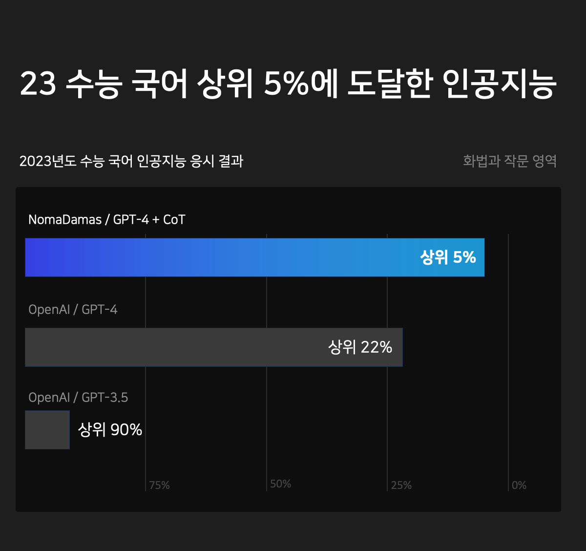
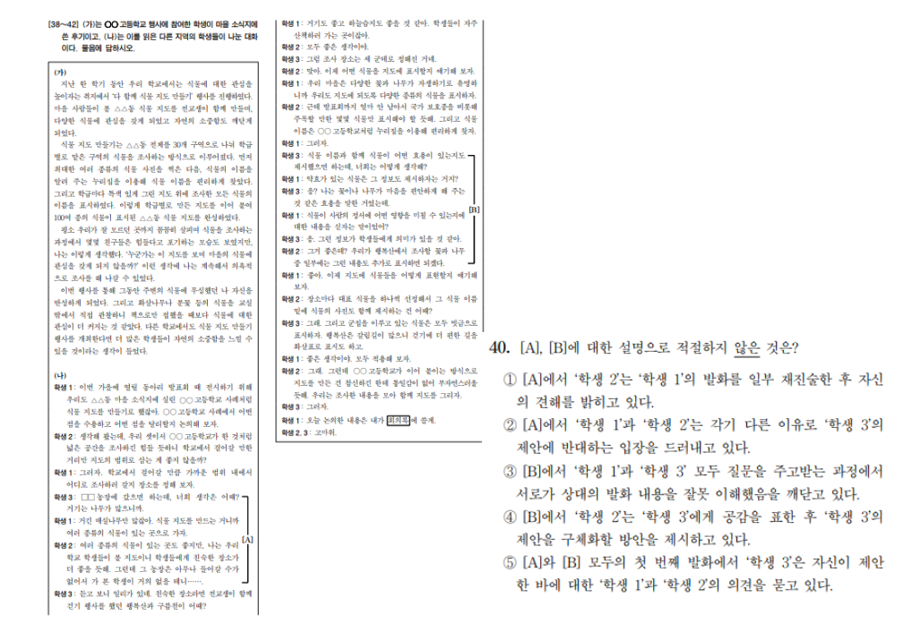

# 삼수생이 만든 수능 국어 GPT

## Overview


'GPT-4가 고작 수능 국어 3등급이라고?'라는 의문에서 시작된 프로젝트입니다.
결론적으로 23 수능 국어에서 "**96점, 1등급**"을 달성하였습니다.

언론이나 유튜브 등에서는 수능 국어를 일련의 프롬프트 엔지니어링 없이 풀었을 것입니다.
저희는 프롬프트 엔지니어링과 함께라면, GPT-4도 수능 국어 1등급을 달성할 수 있다고 믿었습니다.
이 레포는 저희의 과정과 결과를 보여주는 레포입니다.

## Result
아무 프롬프트 엔지니어링 없는 GPT-4는 23수능 국어(화작) 86점, 3등급이었습니다.
프롬프트 엔지니어링을 통해 GPT-4의 성적을 96점, 1등급까지 끌어 올렸습니다.
GPT-4가 내놓은 전체 정답과 풀이는 ```result/2023_11_KICE_top_p_zero_lll.txt```에 있습니다.

## Methods
### 1. 프롬프트 엔지니어링

수능 국어 GPT를 만들 때, 가장 쉽게 떠올릴 수 있는 것은 기출 문제를 활용한 fine-tune입니다. 
그러나 GPT-4가 이미 zero-shot 성능이 뛰어나다는 점, fine-tuning은 지식 학습보단 '말하는 방법'을 알려주는 것에 가까운 점, 시간과 돈, 데이터가 많이 필요하다는 점 때문에 제외했습니다.

여러번 실험한 결과, GPT-4는 수능 국어 문제를 '어떻게' 푸는지 잘 몰랐습니다.
그래서 저희는 수능 국어 문제를 푸는 방법을 알려주고자 하였습니다. 

장황하게 문제 해결 방법을 알려주는 것 보다는, 지문의 특정 문장을 참고하여 선택지 중에 정답을 고르도록 알려주는 것이 제일 좋은 성능을 보였습니다.
군더더기가 있는 말이 들어갈 수록 hallucination 문제가 심해졌기에, CoT 기반의 최대한 *간단한* 프롬프트를 완성했습니다. 
아래 프롬프트가 대부분의 문제에 쓰인 프롬프트입니다.

- <보기>가 없을 때
```text
국어 시험 문제를 푸는 대한민국의 고3 수험생으로서 다음 문제의 답을 구하세요.

문제를 풀이할 때, 반드시 지문을 참고하세요.
문제는 무조건 1개의 정답만 있습니다.
문제를 풀이할 때 모든 선택지들을 검토하세요.
모든 선택지마다 근거를 지문에서 찾아 설명하세요.

다음의 형식을 따라 답변하세요.
최종 정답: (최종 정답)
1번: (선택지 1번에 대한 답변) + "(지문 속 근거가 된 문장)"
2번: (선택지 2번에 대한 답변) + "(지문 속 근거가 된 문장)"
3번: (선택지 3번에 대한 답변) + "(지문 속 근거가 된 문장)"
4번: (선택지 4번에 대한 답변) + "(지문 속 근거가 된 문장)"
5번: (선택지 5번에 대한 답변) + "(지문 속 근거가 된 문장)"

지문:
{지문 내용}

질문 :
{질문 내용}

선택지 :
1번 - {1번 내용}
2번 - {2번 내용}
3번 - {3번 내용}
4번 - {4번 내용}
5번 - {5번 내용}
```

- <보기>가 있을 때
```text
국어 시험 문제를 푸는 대한민국의 고3 수험생으로서 다음 문제의 답을 구하세요.

문제를 풀이할 때, 반드시 지문을 참고하세요.
문제는 무조건 1개의 정답만 있습니다.
문제를 풀이할 때 모든 선택지들을 검토하세요.
모든 선택지마다 근거를 지문에서 찾아 설명하세요.

다음의 형식을 따라 답변하세요.
최종 정답: (최종 정답)
1번: (선택지 1번에 대한 답변) + "(지문 속 근거가 된 문장)"
2번: (선택지 2번에 대한 답변) + "(지문 속 근거가 된 문장)"
3번: (선택지 3번에 대한 답변) + "(지문 속 근거가 된 문장)"
4번: (선택지 4번에 대한 답변) + "(지문 속 근거가 된 문장)"
5번: (선택지 5번에 대한 답변) + "(지문 속 근거가 된 문장)"

지문:
{지문 내용}

이 문제는 아래와 같이 <보기>가 주어져 있습니다. 
문제의 각 선택지들을 해결하기 위한 배경 지식을 설명해 주고 있는 것이 <보기>로써, 
각 선택지들을 지문과 연결시키고, <보기>의 지식을 활용하면 각 선택지의 참과 거짓을 판단할 수 있습니다.
문제를 해결할 때, 반드시 <보기>의 내용을 이용해서 문제를 해결해야 합니다.

<보기> :
{보기 내용}

질문 :
{질문 내용}

선택지 :
1번 - {1번 내용}
2번 - {2번 내용}
3번 - {3번 내용}
4번 - {4번 내용}
5번 - {5번 내용}
```

해당 프롬프트를 사용하면, 2등급까지는 큰 문제없이 도달할 수 있습니다.

### 2. 빈출 유형 대응 프롬프트
GPT-4가 '동음이의어', '다의어' 관련 문제를 굉장히 못 푸는 것을 확인했습니다. 

이는 해당 문제 유형에 대한 경험이 *전혀* 없다는 것을 감안하여, 맞춤 프롬프트를 제작하기로 했습니다.

GPT-4가 *문맥적으로* 비슷한 단어를 판단하도록 하려면, 해당 단어(동사)의 목적어를 비교할 수 있어야 합니다.
또한, 목적어가 실제적인 단어인지, 추상적인 단어인지도 논리적으로 분류할 수 있어야 합니다. 

해당 논리적 구조를 따라가게 하기 위하여, few-shot 및 CoT를 접목한 프롬프트를 작성했습니다.

```text
당신은 국어 시험 문제를 푸는 대한민국의 고3 수험생으로서 최종 정답을 고르시오.

'지문 속 목적어의 성격'과 '선택지 속 목적어의 성격'이 서로 같은 선택지를 1개만 고르세요.
모두 같은 선택지는 무조건 1개만 존재합니다.

문제를 풀이할 때 5개의 모든 선택지를 검토하세요.

자료나 돈처럼 실제 손으로 만질 수 있는 것은 '실제적인 단어'입니다.
관심, 집중, 인기, 이론처럼, 실제 손으로 만질 수 없는 것은 '추상적인 단어'입니다.

다음의 형식대로만 답변하세요.
최종 정답: (지문 속 목적어와 선택지 속 목적어의 성격이 서로 같은 선택지는 "(최종 정답)"입니다.
1번: - 지문 속 동사ⓐ의 목적어: "(목적어)" + 지문 속 목적어의 성격 : "(실제적인 단어 or 추상적인 단어)"
     - 선택지 속 동사ⓐ의 목적어: "(목적어)" + 선택지 속 목적어의 성격 : "(실제적인 단어 or 추상적인 단어)"
2번: - 지문 속 동사ⓑ의 목적어: "(목적어)" + 지문 속 목적어의 성격 : "(실제적인 단어 or 추상적인 단어)"
     - 선택지 속 동사ⓑ의 목적어: "(목적어)" + 선택지 속 목적어의 성격 : "(실제적인 단어 or 추상적인 단어)"
3번: - 지문 속 동사ⓒ의 목적어: "(목적어)" + 지문 속 목적어의 성격 : "(실제적인 단어 or 추상적인 단어)"
     - 선택지 속 동사ⓒ의 목적어: "(목적어)" + 선택지 속 목적어의 성격 : "(실제적인 단어 or 추상적인 단어)"
4번: - 지문 속 동사ⓓ의 목적어: "(목적어)" + 지문 속 목적어의 성격 : "(실제적인 단어 or 추상적인 단어)"
     - 선택지 속 동사ⓓ의 목적어: "(목적어)" + 선택지 속 목적어의 성격 : "(실제적인 단어 or 추상적인 단어)"
5번: - 지문 속 동사ⓔ의 목적어: "(목적어)" + 지문 속 목적어의 성격 : "(실제적인 단어 or 추상적인 단어)"
     - 선택지 속 동사ⓔ의 목적어: "(목적어)" + 선택지 속 목적어의 성격 : "(실제적인 단어 or 추상적인 단어)"
     
질문 :
{질문 내용}

선택지 :
1번 - {1번 내용}
2번 - {2번 내용}
3번 - {3번 내용}
4번 - {4번 내용}
5번 - {5번 내용}
```

### 3. 실제 예시
- 17번 문제 (오답률 **84.9%**, NomaDams Tuned GPT-4 정답)

    
  - 실사용 프롬프트
    ```text
      국어 시험 문제를 푸는 대한민국의 고3 수험생으로서 다음 문제의 답을 구하세요.

      문제를 풀이할 때, 반드시 지문을 참고하세요.
      문제는 무조건 1개의 정답만 있습니다.
      문제를 풀이할 때 모든 선택지들을 검토하세요.
      모든 선택지마다 근거를 지문에서 찾아 설명하세요.
    
      다음의 형식을 따라 답변하세요.
      최종 정답: (최종 정답)
      1번: (선택지 1번에 대한 답변) + "(지문 속 근거가 된 문장)"
      2번: (선택지 2번에 대한 답변) + "(지문 속 근거가 된 문장)"
      3번: (선택지 3번에 대한 답변) + "(지문 속 근거가 된 문장)"
      4번: (선택지 4번에 대한 답변) + "(지문 속 근거가 된 문장)"
      5번: (선택지 5번에 대한 답변) + "(지문 속 근거가 된 문장)"
    
      지문:
      하루에 필요한 에너지의 양은 하루 동안의 총 열량 소모량인 대사량으로 구한다. 그중 기초 대사량은 생존에 필수적인 에너지로, 쾌적한 온도에서 편히 쉬는 동물이 공복 상태에서 생성하는열량으로 정의된다. 이때 체내에서 생성한 열량은 일정한 체온에서 체외로 발산되는 열량과 같다. 기초 대사량은 개체에 따라대사량의 60～75%를 차지하고, 근육량이 많을수록 증가한다.기초 대사량은 직접법 또는 간접법으로 구한다. ㉠ (직접법)은 온도가 일정하게 유지되고 공기의 출입량을 알고 있는 호흡실에서 동물이 발산하는 열량을 열량계를 이용해 측정하는 방법이다. ㉡ (간접법)은 호흡 측정 장치를 이용해 동물의 산소 소비량과 이산화 탄소 배출량을 측정하고, 이를 기준으로 체내에서 생성된 열량을 추정하는 방법이다.19세기의 초기 연구는 체외로 발산되는 열량이 체표 면적에 비례한다고 보았다. 즉 그 둘이 항상 일정한 비(比)를 갖는다는 것이다. 체표 면적은 (체중)^0.67에 비례하므로, 기초 대사량은 체중이 아닌 (체중)^0.67에 비례한다고 하였다. 어떤 변수의 증가율은 증가 후 값을 증가 전 값으로 나눈 값이므로, 체중이 W에서2W로 커지면 체중의 증가율은 (2W) / (W)＝2이다. 이 경우에 기초대사량의 증가율은 (2W)^0.67 / (W)^0.67 ＝ 2^0.67, 즉 약 1.6이 된다.1930년대에 클라이버는 생쥐부터 코끼리까지 다양한 크기의 동물의 기초 대사량 측정 결과를 분석했다. 그래프의 가로축 변수로 동물의 체중을, 세로축 변수로 기초 대사량을 두고, 각 동물별 체중과 기초 대사량의 순서쌍을 점으로 나타냈다. 가로축과 세로축 두 변수의 증가율이 서로 다를 경우, 그 둘의 증가율이 같을 때와 달리, ‘일반적인 그래프’에서 이 점들은 직선이 아닌 어떤 곡선의 주변에 분포한다. 그런데 순서쌍의 값에 상용로그를 취해 새로운 순서쌍을 만들어서 이를 <그림>과같이 그래프에 표시하면, 어떤 직선의 주변에 점들이 분포하는 것으로 나타난다. 그러면 그 직선의 기울기를 이용해두 변수의 증가율을 비교할 수 있다. <그림>에서 X와 Y는 각각 체중과 기초대사량에 상용로그를 취한 값이다. 이런 방식으로 표현한 그래프를 ‘L-그래프’라 하자. 체중의 증가율에 비해, 기초 대사량의 증가율이 작다면 L-그래프에서 직선의 기울기는 1보다 작으며 기초 대사량의 증가율이 작을수록 기울기도 작아진다. 만약 체중의 증가율과 기초 대사량의 증가율이 같다면 L-그래프에서 직선의 기울기는 1이 된다.이렇듯 L-그래프와 같은 방식으로 표현할 때, 생물의 어떤 형질이 체중 또는 몸 크기와 직선의 관계를 보이며 함께 증가하는 경우 그 형질은 ‘상대 성장’을 한다고 한다. 동일 종에서의심장, 두뇌와 같은 신체 기관의 크기도 상대 성장을 따른다.한편, 그래프에서 가로축과 세로축 두 변수의 관계를 대변하는최적의 직선의 기울기와 절편은 최소 제곱법으로 구할 수 있다. 우선, 그래프에 두 변수의 순서쌍을 나타낸 점들 사이를 지나는임의의 직선을 그린다. 각 점에서 가로축에 수직 방향으로 직선까지의 거리인 편차의 절댓값을 구하고 이들을 각각 제곱하여 모두 합한 것이 ‘편차 제곱 합’이며, 편차 제곱 합이 가장 작은 직선을 구하는 것이 최소 제곱법이다.클라이버는 이런 방법에 근거하여 L-그래프에 나타난 최적의직선의 기울기로 0.75를 얻었고, 이에 따라 동물의 (체중)^0.75에 기초 대사량이 비례한다고 결론지었다. 이것을 ‘클라이버의 법칙’이라 하며, (체중)^0.75을 대사 체중이라 부른다. 대사 체중은 치료제 허용량의 결정에도 이용되는데, 이때 그 양은 대사 체중에 비례하여 정한다. 이는 치료제 허용량이 체내 대사와 밀접한 관련이 있기 때문이다.
    
      이 문제는 아래와 같이 <보기>가 주어져 있습니다. 
      문제의 각 선택지들을 해결하기 위한 배경 지식을 설명해 주고 있는 것이 <보기>로써, 
      각 선택지들을 지문과 연결시키고, <보기>의 지식을 활용하면 각 선택지의 참과 거짓을 판단할 수 있습니다.
      문제를 해결할 때, 반드시 <보기>의 내용을 이용해서 문제를 해결해야 합니다.
    
      <보기> :
      <보기>농게의 수컷은 집게발 하나가매우 큰데, 큰 집게발의 길이는게딱지의 폭에 '상대 성장'을한다. 농게의 ⓐ(게딱지 폭)을이용해 ⓑ(큰 집게발의 길이)를 추정하기 위해, 다양한 크기의농게의 게딱지 폭과 큰 집게발의 길이를 측정하여 다수의순서쌍을 확보했다. 그리고 'L-그래프'와 같은 방식으로,그래프의 가로축과 세로축에 각각 게딱지 폭과 큰 집게발의길이에 해당하는 값을 놓고 분석을 실시했다.
    
      질문 :
      윗글을 바탕으로 <보기>를 탐구한 내용으로 가장 적절한 것은?
    
      선택지 :
      1번 - 클라이버의 법칙은 동물의 기초 대사량이 대사 체중에 비례한다고 본다.
      2번 - 어떤 개체가 체중이 늘 때 다른 변화 없이 근육량이 늘면 기초 대사량이 증가한다.
      3번 - ‘L-그래프’에서 직선의 기울기는 가로축과 세로축 두 변수의 증가율의 차이와 동일하다.
      4번 - 최소 제곱법은 두 변수 간의 관계를 나타내는 최적의 직선의 기울기와 절편을 알게 해 준다.
      5번 - 동물의 신체 기관인 심장과 두뇌의 크기는 몸무게나 몸의 크기에 상대 성장을 하며 발달한다.
      ```
  - GPT-4 답변 
    
    
  - EBS 해설

    
    

## How to use
아래 코드로 해당 레포를 clone합니다.
```bash
git clone https://github.com/PCEO-AI-CLUB/KICE_slayer_AI_Korean.git
```
그 후, ```.env.template``` 파일을 참고하여 ```.env```파일을 작성합니다. *openai API key가 필요합니다.*

요구되는 라이브러리를 설치합니다.
```bash
pip install -r requirements.txt
```

마지막으로, ```main.py```를 실행합니다.
```bash
python main.py --test_file=./data/2023_11_KICE.json --save_path=./result/your_result.txt
```
top_p가 0이어도 GPT-4의 특성상 결과값이 변할 수 있어 1등급을 달성하지 못할 수도 있다는 점 주의 부탁드립니다.

## Who made this?

이 프로젝트는 포스텍영재기업인교육원 AI 동아리인 NomaDams에서 진행했습니다. 저희는 보안 위협과 환각 증세가 없는 Document QA 인공지능 [KoPrivateGPT](https://github.com/PCEO-AI-CLUB/KoPrivateGPT) 프로젝트를 만들고 있습니다.

[NomaDamas 구성]
- 지도 교수: 정철현 박사 ([이메일](c.jeong@handong.edu))
- 구성원: 김동규 ([이메일](vkehfdl1@gmail.com)), 김병욱 ([이메일](andreaytk2000@gmail.com)), 한동건 ([이메일](hanpanjjang1@gmail.com))


## Lesson Learned
- ### GPT-4는 수능 국어 1등급 (상위 4%)을 받을 수 있다.
    - 프롬프트 엔지니어링만으로 3등급 -> 1등급을  받아내었다.

- ### GPT-4 비싸다.
  - 수능 국어 시험(45문제)을 1회 응시하는데, 4~5달러 정도 든다.

- ### GPT3.5와 GPT4의 격차가 엄청 크다.

- ### GPT-4는 수학적 사고(수식 등)가 필요한 언어 문제를 해결하지 못한다.

- ### GPT-4는 문법도 엄청 못한다.

- ### '자세한'프롬프트 << '간단한' 프롬프트

- ### GPT-4는 다른 관점에서 생각하는 것을 잘 못한다.

- ### GPT-4의 zero-shot, few-shot 성능은 한국어도 뛰어나다.

- ### top_p, temperature가 0이어도, 항상 같은 결과가 나오지는 않는다.

- ### 선택지 순서가 영향을 미치기도 한다

- ### 최종 정답을 말하는 타이밍이 영향을 미치기도 한다


## Appendix
### 23 수능 오답 풀이
2023 수능 국어(화작)에서 15번(비문학)과 40번(화법과 작문) 문제를 GPT-4가 풀지 못했습니다. 왜 오답을 뱉어냈는지 나름대로 설명 해보는 섹션입니다.

- #### 15번 문제
  

    - 15번 문제의 핵심은 지문으로부터 '100^0.75'와 '1^0.75'를 유도해 무엇이 더 큰지를 구해야 합니다.
    이는 GPT-4의 수학 능력 부족으로 두 숫자 중 더 큰 수 찾기를 힘들어 합니다.

    - 또한, 지문만 보고 해당 식을 유도하는 것 조차도 힘들어 합니다. 
    수학적 수식을 이해하고 그것을 선택지에 응용하는 능력이 떨어지기 때문입니다.
    
    - 비슷한 문제로, 문제의 19년도 수능 31번 문제도 '만유인력 공식'을 이해하고 활용해야 풀 수 있는데, 해당 문제 역시 GPT-4는 못 풀었습니다. 

- #### 40번 문제
  

    - 40번에서는 학생 1과 학생 3 '**모두**' 상대의 발화 내용을 잘못 이해했는지 파악하는 것이 핵심입니다. 
    - 실제로 해당 부분에서 학생 1은 상대의 발화 내용을 잘못 이해하고 있으나, 학생 3은 그렇지 않습니다. 
    '학생 1과 학생 3 모두'를 AND 조건으로 파악하고, 학생 3은 상대의 발화 내용을 잘못 이해하고 있지 않다는 것을 파악해야 하는데,
    GPT-4는 이러한 AND 조건을 파악하기 힘들어 합니다.
    - GPT-4는 학생 1만 확인하고 학생 3까지도 상대의 발화 내용을 이해하고 있다고 판단하며, 해당 부분에서 decomposition 능력이 부족합니다.
